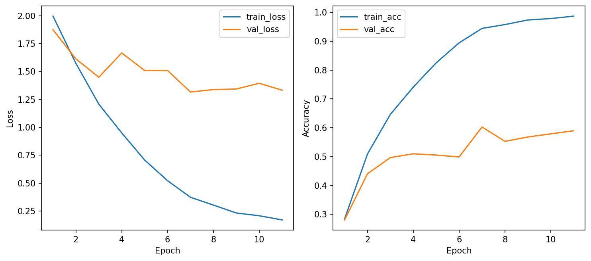
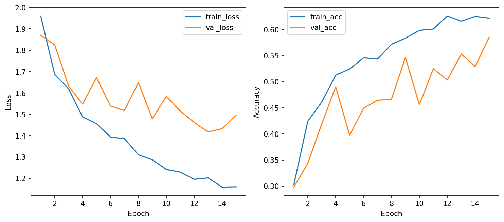
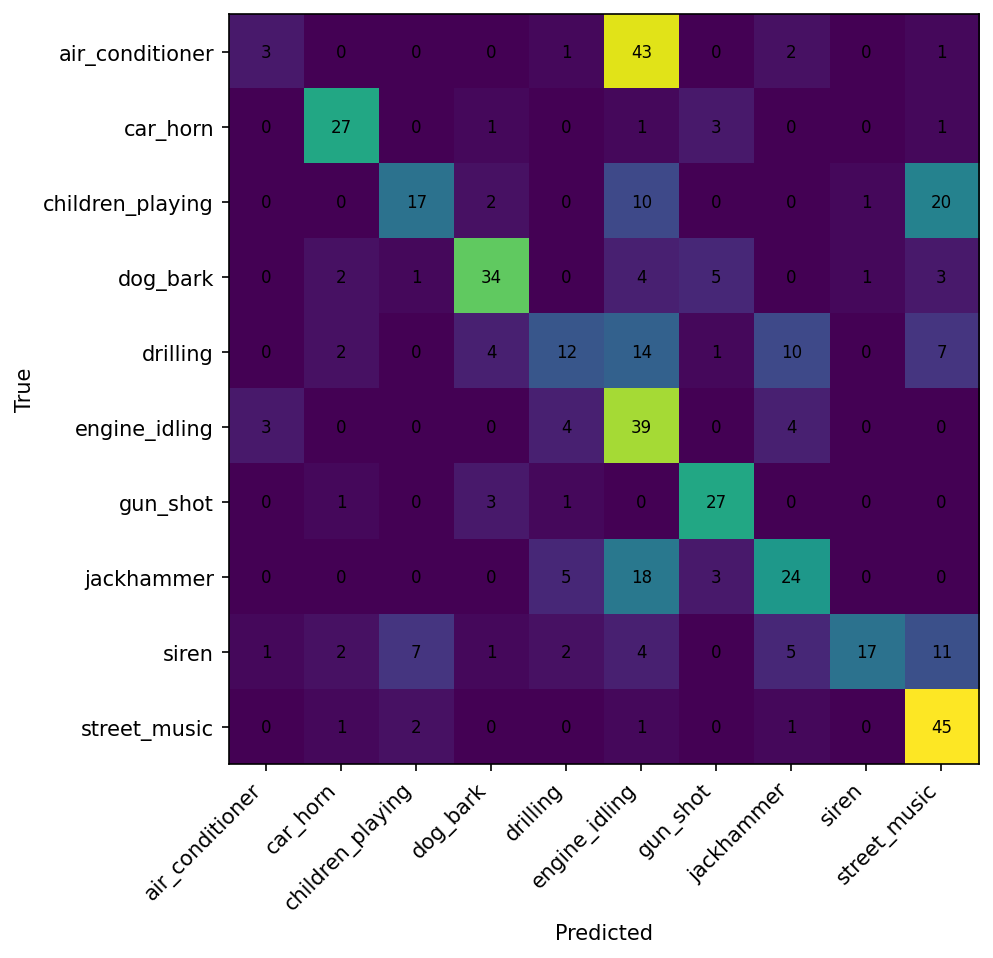
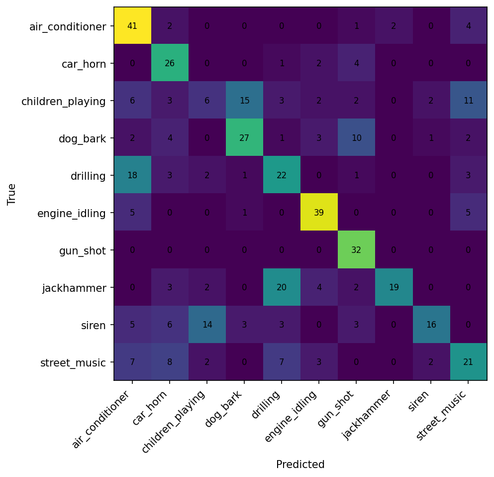

# CSC4005 Lab 3 Report – UrbanSound8K với 1D-CNN

## 1. Thông tin sinh viên

- Họ tên: Phan Việt Hùng  
- Mã sinh viên: 1671040015
- Link GitHub repo:  
https://github.com/FIT-DNU-CS-16-01/csc4005-lab3-1dcnn-VietHung04.git

- Link W&B project:  
https://wandb.ai/phanhung2004dl-dainam-vietnam/csc4005-lab3-urbansound-1dcnn

---

# 2. Mục tiêu thí nghiệm

Mục tiêu của bài lab là xây dựng hệ thống phân loại âm thanh môi trường bằng mô hình Deep Learning sử dụng kiến trúc 1D-CNN trên tập dữ liệu UrbanSound8K.

Các nội dung chính bao gồm:

- Tiền xử lý dữ liệu audio.
- Trích xuất đặc trưng MFCC.
- Huấn luyện mô hình 1D-CNN.
- Theo dõi quá trình huấn luyện bằng Weights & Biases (W&B).
- Phân tích kết quả bằng learning curves và confusion matrix.
- So sánh giữa pipeline MFCC và raw waveform.

---

# 3. Dữ liệu và tiền xử lý

## 3.1. Dataset

Tập dữ liệu sử dụng là UrbanSound8K – bộ dữ liệu phổ biến cho bài toán phân loại âm thanh môi trường.

### Dataset gồm 10 lớp âm thanh:

- air_conditioner
- car_horn
- children_playing
- dog_bark
- drilling
- engine_idling
- gun_shot
- jackhammer
- siren
- street_music

### Thống kê dữ liệu

| Thành phần | Giá trị |
|---|---|
| Dataset | UrbanSound8K |
| Số lớp | 10 |
| Train samples | 1200 |
| Validation samples | 463 |
| Test samples | 465 |

---

## 3.2. Tiền xử lý audio

### Pipeline Baseline MFCC

| Thành phần | Giá trị |
|---|---|
| Feature type | MFCC |
| Input channels | 40 |
| Batch size | 32 |
| Epochs | 12 |
| Optimizer | AdamW |
| Learning rate | 0.001 |
| Weight decay | 0.0001 |
| Scheduler | ReduceLROnPlateau |
| Early stopping | Có |

### Pipeline Raw Waveform

| Thành phần | Giá trị |
|---|---|
| Feature type | Raw waveform |
| Input channels | 1 |
| Batch size | 32 |
| Epochs | 15 |
| Optimizer | AdamW |
| Learning rate | 0.0005 |
| Weight decay | 0.0001 |
| Scheduler | Không giảm LR |
| Early stopping | Không xảy ra |

### Giải thích

Trong bài toán audio classification, dữ liệu âm thanh cần được chuẩn hóa về cùng độ dài và cùng dạng biểu diễn để mô hình học ổn định hơn.

MFCC giúp mô hình tập trung vào đặc trưng phổ âm quan trọng thay vì phải học trực tiếp toàn bộ tín hiệu sóng âm thô.

---

# 4. Mô hình 1D-CNN

## 4.1. Kiến trúc mô hình

```text
Input feature sequence
→ Conv1D Block 1
→ Conv1D Block 2
→ Conv1D Block 3
→ Global Average Pooling
→ Dense Layer
→ Softmax
```

Mô hình sử dụng các lớp tích chập 1 chiều để học đặc trưng theo trục thời gian của âm thanh.

---

## 4.2. Cấu hình mô hình

### Baseline MFCC + 1D-CNN

| Thành phần | Giá trị |
|---|---|
| model_name | mfcc_1dcnn |
| dropout | 0.3 |
| optimizer | AdamW |
| learning rate | 0.001 |
| weight decay | 0.0001 |
| batch size | 32 |
| epochs | 12 |
| patience | 4 |

### Raw Waveform + 1D-CNN

| Thành phần | Giá trị |
|---|---|
| model_name | raw_1dcnn |
| dropout | 0.3 |
| optimizer | AdamW |
| learning rate | 0.0005 |
| weight decay | 0.0001 |
| batch size | 32 |
| epochs | 15 |
| patience | Không dùng |

---

# 5. Kết quả thực nghiệm

## 5.1. Kết quả chính

| Metric | MFCC + 1D-CNN | Raw Waveform + 1D-CNN |
|---|---:|---:|
| Best validation accuracy | 60.26% | 55.29% |
| Test accuracy | 52.69% | 53.55% |
| Best validation loss | 1.3167 | 1.4175 |
| Test loss | 1.3579 | 1.4938 |
| Average epoch time | 6.64 sec | 35.34 sec |
| Total parameters | 137,930 | 129,450 |
| Trainable parameters | 137,930 | 129,450 |

---

# 5.2. Learning Curves

## MFCC + 1D-CNN



### Nhận xét

- Train accuracy tăng rất nhanh từ 28% lên gần 99%.
- Validation accuracy đạt cao nhất khoảng 60%.
- Validation loss có dao động mạnh sau epoch 7.
- Có dấu hiệu overfitting rõ rệt vì train_acc tăng mạnh nhưng val_acc không tăng tương ứng.
- Early stopping đã kích hoạt tại epoch 11 để tránh overfitting thêm.

### Phân tích

MFCC giúp mô hình học nhanh hơn do đặc trưng đã được nén và loại bỏ nhiều nhiễu không cần thiết. Tuy nhiên mô hình vẫn bị giới hạn khả năng tổng quát hóa trên tập validation và test.

---

## Raw Waveform + 1D-CNN



### Nhận xét

- Mô hình học chậm hơn nhiều so với MFCC.
- Train accuracy chỉ đạt khoảng 62%.
- Validation accuracy dao động quanh mức 55%.
- Thời gian huấn luyện mỗi epoch cao hơn rất nhiều (~35 giây).
- Đường cong học tập ổn định hơn nhưng hiệu năng không vượt trội.

### Phân tích

Khi dùng raw waveform, mô hình phải tự học toàn bộ đặc trưng âm thanh trực tiếp từ tín hiệu thô nên quá trình huấn luyện khó hơn và tốn tài nguyên hơn.

---

# 5.3. Confusion Matrix

## MFCC + 1D-CNN



### Nhận xét

Các lớp nhận diện tốt:

- car_horn
- gun_shot
- dog_bark

Các lớp dễ nhầm lẫn:

- air_conditioner
- drilling
- children_playing
- engine_idling

Đặc biệt:

- air_conditioner thường bị nhầm sang engine_idling.
- children_playing thường bị nhầm sang street_music.
- drilling bị nhầm mạnh với engine_idling và jackhammer.

Nguyên nhân chủ yếu là do các lớp này có phổ âm thanh tương đối giống nhau hoặc chứa nhiều tiếng nền.

---

## Raw Waveform + 1D-CNN



### Nhận xét

Các lớp nhận diện tốt:

- gun_shot
- air_conditioner
- engine_idling

Các lớp dễ nhầm:

- children_playing
- siren
- street_music

Đặc biệt:

- gun_shot đạt recall 100%.
- children_playing có accuracy rất thấp do tín hiệu âm thanh phức tạp và chứa nhiều nhiễu.
- siren bị nhầm với children_playing và air_conditioner.

---

# 6. W&B Tracking

## Link W&B Project

https://wandb.ai/phanhung2004dl-dainam-vietnam/csc4005-lab3-urbansound-1dcnn

## Dashboard bao gồm

- Learning curves.
- Validation/Test metrics.
- Hyperparameters.
- Confusion matrix.
- Loss và accuracy theo epoch.

---

# 7. Phân tích và thảo luận

## 1. Vì sao dùng 1D-CNN thay vì MLP?

MLP không tận dụng được tính liên tục theo thời gian của tín hiệu âm thanh.

1D-CNN có khả năng học các mẫu cục bộ theo trục thời gian như:

- nhịp điệu,
- tần số,
- biến đổi âm thanh ngắn hạn.

Điều này giúp mô hình phù hợp hơn với dữ liệu audio.

---

## 2. Kernel 1D đang trượt theo chiều nào?

Kernel của Conv1D trượt theo chiều thời gian của chuỗi audio hoặc chuỗi đặc trưng MFCC.

---

## 3. MFCC giúp mô hình học dễ hơn như thế nào?

MFCC:

- giảm nhiễu,
- giữ lại thông tin phổ quan trọng,
- mô phỏng cảm nhận âm thanh của tai người.

Nhờ đó mô hình học nhanh hơn và ổn định hơn so với raw waveform.

---

## 4. Hạn chế của mô hình hiện tại

- Accuracy chưa cao.
- Overfitting trên tập train.
- Chưa tận dụng kiến trúc mạnh hơn như CRNN hoặc Transformer.
- Chưa áp dụng augmentation mạnh cho audio.

---

## 5. Hướng cải thiện

Có thể cải thiện bằng:

- Data augmentation cho audio.
- Dùng log-mel spectrogram.
- Dùng mô hình sâu hơn.
- Sử dụng transfer learning.
- Tuning hyperparameter tốt hơn.

---

# 8. So sánh các pipeline

| Pipeline | Feature/Input | Test Accuracy | Nhận xét |
|---|---|---:|---|
| Baseline | MFCC + 1D-CNN | 52.69% | Học nhanh, train ổn định hơn |
| Extension | Raw waveform + 1D-CNN | 53.55% | Accuracy nhỉnh hơn nhẹ nhưng train rất chậm |

---

# 9. Kết luận

- 1D-CNN có khả năng học đặc trưng âm thanh hiệu quả hơn MLP.
- MFCC giúp mô hình hội tụ nhanh và ổn định hơn.
- Raw waveform cho kết quả tương đương nhưng chi phí huấn luyện lớn hơn nhiều.
- Confusion matrix cho thấy nhiều lớp có đặc trưng âm thanh tương đồng nên dễ nhầm lẫn.
- W&B giúp theo dõi toàn bộ quá trình huấn luyện và phân tích mô hình trực quan hơn.